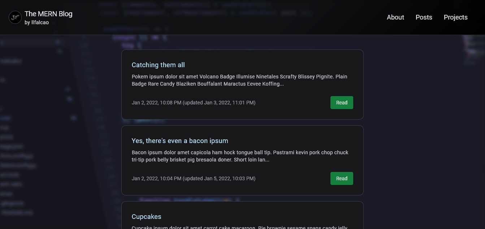
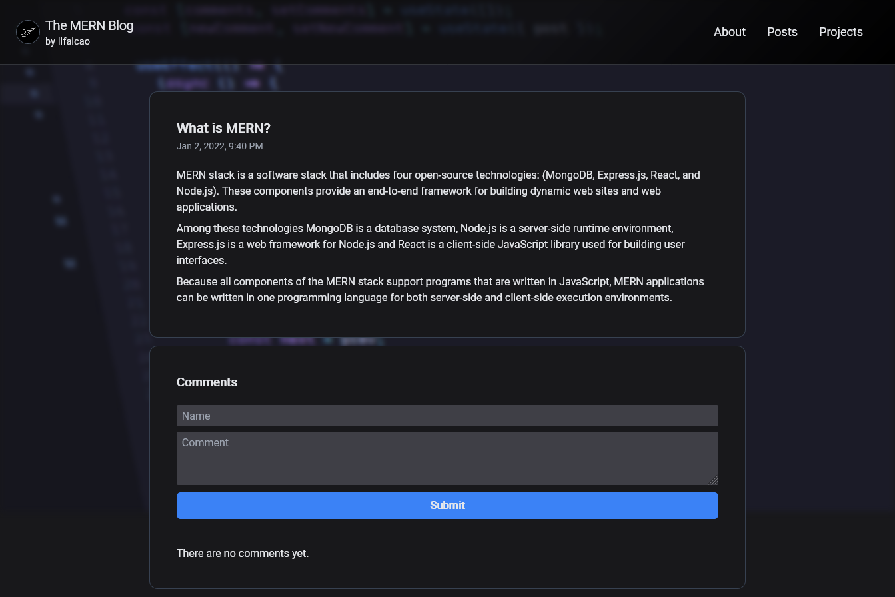
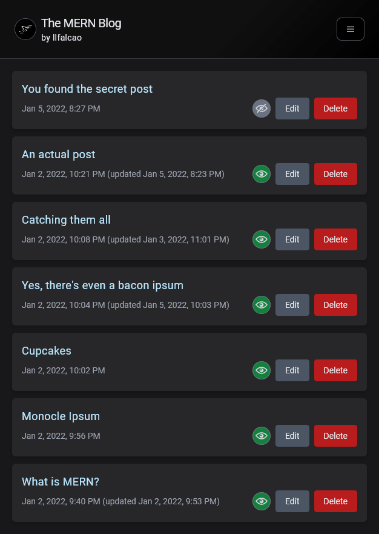

# MERN Blog

A [MERN](https://www.mongodb.com/mern-stack) project for a personal blog. The backend API routes will be consumed by two different front-ends: one for readers to browse and comment, and a private one for publishing and editing posts.

Link: https://llfalcao.github.io/mern-blog

## API

Base URL: https://llfalcao-blog-api.herokuapp.com/api/v1

It will take around 10s for Heroku to wake up the app and then return the data from the database.

#### Posts

| Method | Endpoint              | Description                  |
| ------ | --------------------- | ---------------------------- |
| GET    | /posts                | Get all published posts      |
| POST   | /posts                | Submit a new post            |
| GET    | /posts/:post          | Get info from a post         |
| POST   | /posts/:post/edit     | Edit a post                  |
| POST   | /posts/:post/delete   | Remove a post                |
| GET    | /posts/:post/comments | Get all comments from a post |

#### Comments

| Method | Endpoint                  | Description            |
| ------ | ------------------------- | ---------------------- |
| GET    | /comments/:comment        | Get a specific comment |
| POST   | /comments                 | Submit a new comment   |
| DELETE | /comments/:comment/delete | Remove a comment       |

The admin client allows the admin to edit posts, manage comments, and quickly mark a post as published or unpublished.

## Screenshots

### Home

### Post

### Post Manager (Admin)

